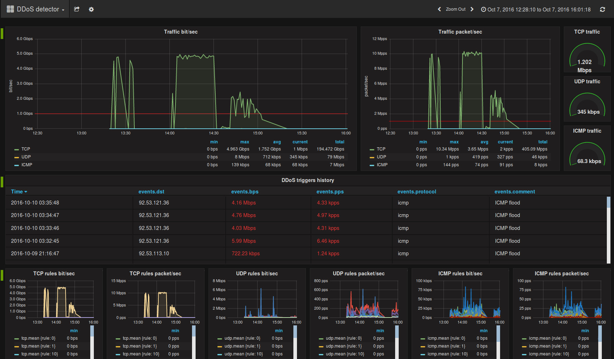

# Детектор DDoS атак #
Система **ddosdetector** - это гибкий инструмент для анализа сетевого трафика и автоматизации процесса защиты от DDoS атак. Система основана на фреимворке [Luigi Rizzo](https://github.com/luigirizzo/netmap) [netmap](https://habrahabr.ru/post/183832/) и спроектирована для работы с большим объемом трафика (10Гб/сек и больше) без потерь производительности.

Система написана на языке C++ (стандарт 11) с использованием OpenSource библиотек *STL* и *Boost (1.55)*. Написание и сборка производилось на *Ubuntu 12.04.5 LTS* и компиляторе *g++-4.8*. Для статического анализа кода, проверки стиля и поиска грубых ошибок использовался *cppcheck* версии 1.73.

Для мониторинга и сбора статистики используется InfluxDB.

*код этого дашборда Grafana в файле ./docs/INFLUXDB.md*

## Принцип работы ##
Демон запускается на SPAN интерфейсе (на этот интерфейс зеркалируется весь трафик защищаемой сети) сервера и начинает "прослушивать" весь трафик. Получаемый трафик пропускается через набор правил. В каждом правиле набор признаков по которым проверяется пакет и триггер, который сработает если условия совпали. Триггер связан с заданием которое выполняет одно действие (логирование, вызов скрипта и т.д.). Все правила добавляемые в систему делятся на несколько глобальных групп соответствующих L4 протоколам (TCP, UDP, ICMP и т.д.). Каждое добавляемое правило добавляется в одну группу и в соответсвии с протоколом группы и может иметь различные параметры обработки трафика (подробную информацию по доступным командам можно получить в консоли управления, набрав "help"). У каждого правила, в любой группе, имеется ряд обязательных праметров, без которых добавить правило не удастся:
* параметр src/dst ip
* параметр порога триггера (указывающий критическое значения по достижению которого вызывается действие триггера)

Пример правила для поиска трафика:
```c++
ddoscontrold> show rules
TCP rules (num, rule, counter):
  -d 92.53.96.141/32 --pps-th 100p --hlen <20 --pps-th-period 60 --action log:/tmp/test.log --next    : 814.00p/s (735.03Kb/s), 157106 packets, 22975832 bytes
```
Подробнее функционал описан в разделе "Упрaвление".

Управление демоном осуществляется через консоль (доступ по TCP порту или UNIX сокету) стандартными утилитами Linux (telnet/netcat/socat). В консоли управления пользователю предоставляется командная строка с параметрами выделения, обнаружения, подсчета трафика, а также параметрами реакции на тот или иной трафик.

Статистика может быть отправлена в базу данных InfluxDB для анализа и составления графиков.

## Установка ##
Так как система работает на основе драйвера netmap, требуется установка этого драйвера.
### Установка netmap на Ubuntu ###
Для корректной работы драйвера netmap необходимо собрать модуль netmap и собрать драйвера сетевой карты с поддержкой netmap. Для этого требуется скачать исходники ядра установленного в системе (в инструкции ниже ядро 3.10.90) и собрать netmap с указанием этих исходников (сборка netmap пропатчет драйвера сетевой карты из исходников и собирет их).

Скачиваем исходники ядра и распаковываем:
```bash
cd /usr/src
wget -S https://cdn.kernel.org/pub/linux/kernel/v3.x/linux-3.10.90.tar.xz
tar xpvf ./linux-3.10.90.tar.xz -C /usr/src/
```
либо из репозитория:
```bash
cd /usr/src
apt-get source linux-image-3.10.90
```
скачиваем netmap:
```bash
git clone https://github.com/luigirizzo/netmap
```
настраиваем сборку модуля указывая исходники ядра и какие драйверы нам нужны
```bash
cd ./netmap/LINUX/
./configure --kernel-sources=/usr/src/linux-3.10.90 --drivers=igb,ixgbe,e1000e
```
собираем:
```bash
make
```
загружаем модули в систему:
```bash
insmod /usr/src/netmap/LINUX/netmap.ko
# для 10Гб/сек сетевой карты Intel
rmmod ixgbe && insmod /usr/src/netmap/LINUX/ixgbe/ixgbe.ko
# для 1Гб/сек сетевой карты
rmmod igb && insmod /usr/src/netmap/LINUX/igb/igb.ko
rmmod e1000e && insmod /usr/src/netmap/LINUX/e1000e/e1000e.ko
```
после этого в системе должен появиться интерфейс работы с netmap:
```bash
# ls /dev/netmap 
/dev/netmap
```

### Установка ddosdetector ###
собираем ddosdetector:
```bash
git clone https://velizarx@bitbucket.org/velizarx/ddosdetector.git
cd ./ddosdetector
make
```

## Запуск ##
Для запуска проекта, у текущего пользователя должны быть права доступа на чтение и запись к интерфейсу netmap (*/dev/netmap*). Сетевой интерфейс должен быть включен. Драйвер сетевой карты с поддержкой netmap должен быть загружен:
```bash
# lsmod | grep netmap
netmap                143360  27 ixgbe
# modinfo ixgbe | grep depends 
depends:        mdio,netmap,dca
```
**Если подключение к серверу удаленное (SSH, telnet и т.д.), запуск системы ddosdetector на том же сетевом интерфейсе, через который осуществляется подключение, приведет к потере доступа, так как netmap драйвер отключает сетевую карту от ОС!**

Запуск ddosdetector (в примере интерфейс eth4):
```bash
cd <path_to_ddosdetector_directory>
./ddosdetector -i eth4 -r ~/ddosdetector.rules -p /tmp/ddosd.sock -l ~/ddosdetector.log
```
где:
* *-i eth4 (**параметр обязателен**)* - *eth4* интерфейс запуска системы (на этом интерфейсе должен быть драйвер netmap см. README);
* *-r ~/ddosdetector.rules* - файл откуда будут загружены правила (этот параметр необязателен, по-умолчанию поиск файла производится по пути */etc/ddosdetector.rules*);
* *-p /tmp/ddosd.sock* - как запустить консоль (в данном случае UNIX socket, файл */tmp/ddosd.sock*), может быть путем к файлу, либо номером порта (тогда запускается TCP сервер на 127.0.0.1 и указанном порту), параметр необязателен, по-умолчанию запускается TCP сервер на порту 9090;
* *-l ~/ddosdetector.log* - путь к лог файлу, по-умолчанию вывод в консоль

после этого к системе можно подключиться:
```bash
socat - UNIX-CONNECT:/tmp/ddosd.sock
```

## Управление ##
### Конфигурационные файлы ###
При запуске система пытается прочитать два конфигурационных файла:
* /etc/ddosdetector.conf - общие настройки системы
* /etc/ddosdetector.rules - сохраненные правила

Файл */etc/ddosdetector.conf* сожет содержать следующие настройки (значение натроек понятно из названия):
```ini
[Main]
Interface = eth0
Rules = /etc/ddosdetector.rules
Log = /var/log/ddosdetector.log
Port = 9090

[IndluxDB]
Enable = yes
User = ddosdetector
Password = p@$$w0rd
Database = ddosdetector
Host = localhost
Port = 8086
Period = 30
```
Если конфигурационный файл существует, то запуск системы сводится к выполнению команды:
```bash
./ddosdetector
```
### Подключение к серверу управления ###
Для управления системой необходимо подключиться к запущенному демону. В зависимости от параметров запуска подключаться необходимо либо к TCP серверу либо к UNIX socket.

#### TCP сервер ####
```bash
telnet 127.1 9090
```
где 9090 - это порт запуска по-умолчанию, либо указанный параметром порт

#### UNIX socket сервер ####
```bash
# socat - UNIX-CONNECT:/tmp/ddosd.sock 
ddoscontrold>
```
где /tmp/ddosd.sock - сокет-файл указанный при запуске системы

### Настройка ###
После подключения к серверу управления можно вывести список всех доступных команд управления:

```
#!bash

$ socat - UNIX-CONNECT:/tmp/ddosd.sock 
ddoscontrold> help
Console commands:<type> - may be TCP, UDP or ICMP; <num> - number (0..65535);
  help                                show this help
  add rule <type> <rule>              add new rule
  insert rule <type> <num> <rule>     insert new rule by number
  del rule <type> <num>               add new rule
  show rules                          print all rules with counters
  reload rules                        reload all rules from file
  exit                                close connection


Base rule options:
  --pps-th arg          trigger threshold incomming packets per second 
                        (p,Kp,Mp,Tp,Pp)
  --bps-th arg          trigger threshold incomming bits per second 
                        (b,Kb,Mb,Tb,Pb)
  --pps-th-period arg   trigger threshold period in seconds (default 10)
  --bps-th-period arg   trigger threshold period in seconds (default 10)
  -a [ --action ] arg   run action when trigger active (type:param)
  --next                go to next rule in list

IPv4 rule options:
  -d [ --dstip ] arg    destination ip address/net
  -s [ --srcip ] arg    source ip address/net

TCP rule options:
  --dport arg           destination port
  --sport arg           source port
  --seq arg             check if sequence number = or > or < arg
  --win arg             check if window size number = or > or < arg
  --ack arg             check if acknowledgment number = or > or < arg
  --hlen arg            check if TCP header len = or > or < arg (in bytes)
  --tcp-flag arg        TCP flags <flag>:<enable>, where <enable> - 1 or 0; 
                        <flag> - U or R or P or S or A or F.

UDP rule options:
  --dport arg           destination port
  --sport arg           source port
  --hlen arg            check if TCP header len = or > or < arg (in bytes)

ICMP rule options:
  --type arg            check if ICMP packet type = or > or < arg
  --code arg            check if ICMP packet code = or > or < arg

```

Отображаемые в help параметры делятся на два типа: параметры управления коллекцией правил (первая часть "Console commands") и параметры самих правил (все что ниже).

Правила фильтрации трафика могут быть добавлены в одну из веток протоколов L4 уровня, за это отвечает обязательный аргумент *<type>*, также при вставке и удалении правила указатель на правило - это его номер (параметр *<num>*):

```bash
add rule <type> <rule>              add new rule
insert rule <type> <num> <rule>     insert new rule by number
del rule <type> <num>               add new rule
show rules                          print all rules with counters
```

#### Просмотр правил ####
Для просмотра работающих правил и их счетчиков используется команда: **show rules**

```bash
ddoscontrold> show rules
TCP rules (num, rule, counter):
    0:   -d 92.53.96.141/32 --pps-th 100p --seq =0 --pps-th-period 60 --action log:/tmp/test.log --next     : 0.00p/s (0.00b/s), 0 packets, 0 bytes
    1:   -d 92.53.96.141/32 --pps-th 100p --win =0 --pps-th-period 60 --action log:/tmp/test.log --next     : 6.00p/s (2.88Kb/s), 6 packets, 360 bytes
    2:   -d 92.53.96.141/32 --pps-th 100p --hlen <20 --pps-th-period 60 --action log:/tmp/test.log --next   : 0.00p/s (0.00b/s), 0 packets, 0 bytes
    3:   -d 92.53.96.141/32 --pps-th 100p --pps-th-period 60 --action script:/tmp/test_script.py --next     : 330.00p/s (588.79Kb/s), 330 packets, 73611 bytes
    4:   -d 92.53.96.141/32 --dport 80-443 --pps-th 10p --action log:/tmp/test.log                          : 330.00p/s (588.79Kb/s), 330 packets, 73611 bytes
    5:   -d 92.53.116.85/32 --bps-th 100Mb --action log:/tmp/test.log                                       : 0.00p/s (0.00b/s), 0 packets, 0 bytes
    6:   -d 92.53.116.23/32 --bps-th 100Mb --action log:/tmp/test.log                                       : 0.00p/s (0.00b/s), 0 packets, 0 bytes
    7:   -d 92.53.116.22/32 --bps-th 100Mb --action log:/tmp/test.log                                       : 0.00p/s (0.00b/s), 0 packets, 0 bytes
    8:   -d 92.53.116.70/32 --bps-th 100Mb --action log:/tmp/test.log                                       : 4.00p/s (6.42Kb/s), 4 packets, 802 bytes
    9:   -d 0.0.0.0/0 --bps-th 100Mb --action syslog                                                        : 1.12Mp/s (7.71Gb/s), 1143222 packets, 985391222 bytes
UDP rules (num, rule, counter):
    0:   -d 92.53.116.200/32 --pps-th 100p --dport 53   : 1.99Kp/s (1.33Mb/s), 1986 packets, 166867 bytes
ICMP rules (num, rule, counter):
    0:   -d 92.53.96.141/32 --pps-th 100p --type =8 --code =0   : 2.00p/s (1.57Kb/s), 2 packets, 196 bytes
    1:   -d 92.53.96.141/32 --pps-th 100p --type =0 --code =0   : 0.00p/s (0.00b/s), 0 packets, 0 bytes
```
первая цифра - номер команды, далее текст команды. После второго двоеточия - счетчики правила. Весь список правил делится по протоколам L4 уровня.

#### Добавление правил ####
Например, команда добавления правила отлова TCP SYN пакетов с Window size = 0 (SYN Flood атака) с записью в лог если трафик таких пакетов превышает 10Мб/сек в течении 1 минуты:
```bash
ddoscontrold> add rule TCP -d 92.53.96.141/32 --bps-th 10Mb --win =0 --tcp-flag S:1,A:0 --action log:/tmp/test_syn.log --pps-th-period 60
ddoscontrold> show rules
TCP rules (num, rule, counter):
    0:   -d 92.53.96.141/32 --pps-th 100p --seq =0 --pps-th-period 60 --action log:/tmp/test.log --next                   : 0.00p/s (0.00b/s), 0 packets, 0 bytes
    1:   -d 92.53.96.141/32 --pps-th 100p --win =0 --pps-th-period 60 --action log:/tmp/test.log --next                   : 1.00p/s (480.00b/s), 2232322 packets, 134037624 bytes
    2:   -d 92.53.96.141/32 --pps-th 100p --hlen <20 --pps-th-period 60 --action log:/tmp/test.log --next                 : 0.00p/s (0.00b/s), 0 packets, 0 bytes
    3:   -d 92.53.96.141/32 --pps-th 100p --pps-th-period 60 --action script:/tmp/test_script.py --next                   : 147.00p/s (191.18Kb/s), 408042174 packets, 59905853944 bytes
    4:   -d 92.53.96.141/32 --dport 80-443 --pps-th 10p --action log:/tmp/test.log                                        : 147.00p/s (191.18Kb/s), 407567038 packets, 59820452344 bytes
    5:   -d 92.53.116.85/32 --bps-th 100Mb --action log:/tmp/test.log                                                     : 0.00p/s (0.00b/s), 2072576 packets, 252829696 bytes
    6:   -d 92.53.116.23/32 --bps-th 100Mb --action log:/tmp/test.log                                                     : 0.00p/s (0.00b/s), 2490368 packets, 1139314688 bytes
    7:   -d 92.53.116.22/32 --bps-th 100Mb --action log:/tmp/test.log                                                     : 0.00p/s (0.00b/s), 9543749 packets, 10454889750 bytes
    8:   -d 92.53.116.70/32 --bps-th 100Mb --action log:/tmp/test.log                                                     : 5.00p/s (27.42Kb/s), 2732037 packets, 887561571 bytes
    9:   -d 0.0.0.0/0 --bps-th 100Mb --action syslog                                                                      : 1.12Mp/s (7.63Gb/s), 1788817419102 packets, 1539206358632609 bytes
   10:   -d 92.53.96.141/32 --bps-th 10Mb --win =0 --tcp-flag S:1,A:0 --action log:/tmp/test_syn.log --pps-th-period 60   : 0.00p/s (0.00b/s), 0 packets, 0 bytes
UDP rules (num, rule, counter):
    0:   -d 92.53.116.200/32 --pps-th 100p --dport 53   : 1.65Kp/s (1.11Mb/s), 2132791521 packets, 179117436614 bytes
ICMP rules (num, rule, counter):
    0:   -d 92.53.96.141/32 --pps-th 100p --type =8 --code =0   : 0.00p/s (0.00b/s), 1269760 packets, 124436480 bytes
    1:   -d 92.53.96.141/32 --pps-th 100p --type =0 --code =0   : 0.00p/s (0.00b/s), 0 packets, 0 bytes
```
Правило добавилось в конец цепочки правил TCP.
#### Удаление правил ####
Удаление правила производится по его номеру и типу:
```bash
ddoscontrold> del rule TCP 11
Error operation rule: not found 11 rule
ddoscontrold> del rule TCP 10
ddoscontrold> show rules
TCP rules (num, rule, counter):
    0:   -d 92.53.96.141/32 --pps-th 100p --seq =0 --pps-th-period 60 --action log:/tmp/test.log --next     : 0.00p/s (0.00b/s), 0 packets, 0 bytes
    1:   -d 92.53.96.141/32 --pps-th 100p --win =0 --pps-th-period 60 --action log:/tmp/test.log --next     : 0.00p/s (0.00b/s), 9144557568 packets, 549076107264 bytes
    2:   -d 92.53.96.141/32 --pps-th 100p --hlen <20 --pps-th-period 60 --action log:/tmp/test.log --next   : 0.00p/s (0.00b/s), 0 packets, 0 bytes
    3:   -d 92.53.96.141/32 --pps-th 100p --pps-th-period 60 --action script:/tmp/test_script.py --next     : 36.00p/s (29.01Kb/s), 1671489351748 packets, 245395354980098 bytes
    4:   -d 92.53.96.141/32 --dport 80-443 --pps-th 10p --action log:/tmp/test.log                          : 29.00p/s (22.78Kb/s), 1669542711350 packets, 245045485856773 bytes
    5:   -d 92.53.116.85/32 --bps-th 100Mb --action log:/tmp/test.log                                       : 0.00p/s (0.00b/s), 8490487811 packets, 1036269433082 bytes
    6:   -d 92.53.116.23/32 --bps-th 100Mb --action log:/tmp/test.log                                       : 0.00p/s (0.00b/s), 10201411584 packets, 4666950860800 bytes
    7:   -d 92.53.116.22/32 --bps-th 100Mb --action log:/tmp/test.log                                       : 0.00p/s (0.00b/s), 39095005184 packets, 42827336540160 bytes
    8:   -d 92.53.116.70/32 --bps-th 100Mb --action log:/tmp/test.log                                       : 0.00p/s (0.00b/s), 11191435264 packets, 3635753590784 bytes
    9:   -d 0.0.0.0/0 --bps-th 100Mb --action syslog                                                        : 1.19Mp/s (8.19Gb/s), 7327549925466711 packets, 6305063082930564060 bytes
UDP rules (num, rule, counter):
    0:   -d 92.53.116.200/32 --pps-th 100p --dport 53   : 1.33Kp/s (897.29Kb/s), 8736549554751 packets, 733718174039092 bytes
ICMP rules (num, rule, counter):
    0:   -d 92.53.96.141/32 --pps-th 100p --type =8 --code =0   : 0.00p/s (0.00b/s), 5201125376 packets, 509710131200 bytes
    1:   -d 92.53.96.141/32 --pps-th 100p --type =0 --code =0   : 0.00p/s (0.00b/s), 0 packets, 0 bytes
```
#### Перезагрузка правил из файла ####
При запуске, система проверяет конфигурационный файл сохраненных ранее правил (по умолчанию */etc/ddosdetector.rules*). Если сиситема уже запущена, можно перезагрузить правила из файла вручную. Перезагрузка правил из файла выполняется либо из консоли управления командой **reload rules** либо отправкой сигнала SIGHUP демону. Например файл правил имеет содержимое:
```bash
$ cat ~/ddosdetector.rules
TCP -d 92.53.96.141/32 --pps-th 100p --seq =0 --pps-th-period 60 --action log:/tmp/test.log --next
TCP -d 92.53.96.141/32 --pps-th 100p --win =0 --pps-th-period 60 --action log:/tmp/test.log --next
TCP -d 92.53.96.141/32 --pps-th 100p --hlen <20 --pps-th-period 60 --action log:/tmp/test.log --next
TCP -d 92.53.96.141/32 --pps-th 100p --pps-th-period 60 --action script:/tmp/test_script.py --next
TCP -d 92.53.96.141/32 --dport 80-443 --pps-th 10p --action log:/tmp/test.log
TCP -d 92.53.116.85/32 --bps-th 100Mb --action log:/tmp/test.log
TCP -d 92.53.116.23/32 --bps-th 100Mb --action log:/tmp/test.log
TCP -d 92.53.116.22/32 --bps-th 100Mb --action log:/tmp/test.log
TCP -d 92.53.116.70/32 --bps-th 100Mb --action log:/tmp/test.log
TCP -d 0.0.0.0/0 --bps-th 100Mb --action syslog
# test DNS server traffic
UDP -d 92.53.116.200/32 --pps-th 100p --dport 53 
ICMP -d 92.53.96.141/32 --pps-th 100p --type =8 --code =0
ICMP -d 92.53.96.141/32 --pps-th 100p --type =0 --code =0
TCP -d 92.53.96.141/32 --bps-th 10Mb --win =0 --tcp-flag S:1,A:0 --action log:/tmp/test_syn.log --pps-th-period 60 
```
загружаем файл:
```bash
ddoscontrold> show rules
TCP rules (num, rule, counter):
UDP rules (num, rule, counter):
ICMP rules (num, rule, counter):
ddoscontrold> reload rules
ddoscontrold> show rules
TCP rules (num, rule, counter):
    0:   -d 92.53.96.141/32 --pps-th 100p --seq =0 --pps-th-period 60 --action log:/tmp/test.log --next                   : 0.00p/s (0.00b/s), 0 packets, 0 bytes
    1:   -d 92.53.96.141/32 --pps-th 100p --win =0 --pps-th-period 60 --action log:/tmp/test.log --next                   : 6.00p/s (2.88Kb/s), 6 packets, 360 bytes
    2:   -d 92.53.96.141/32 --pps-th 100p --hlen <20 --pps-th-period 60 --action log:/tmp/test.log --next                 : 0.00p/s (0.00b/s), 0 packets, 0 bytes
    3:   -d 92.53.96.141/32 --pps-th 100p --pps-th-period 60 --action script:/tmp/test_script.py --next                   : 81.00p/s (64.02Kb/s), 81 packets, 8003 bytes
    4:   -d 92.53.96.141/32 --dport 80-443 --pps-th 10p --action log:/tmp/test.log                                        : 81.00p/s (64.02Kb/s), 81 packets, 8003 bytes
    5:   -d 92.53.116.85/32 --bps-th 100Mb --action log:/tmp/test.log                                                     : 2.00p/s (3.23Kb/s), 2 packets, 404 bytes
    6:   -d 92.53.116.23/32 --bps-th 100Mb --action log:/tmp/test.log                                                     : 0.00p/s (0.00b/s), 0 packets, 0 bytes
    7:   -d 92.53.116.22/32 --bps-th 100Mb --action log:/tmp/test.log                                                     : 0.00p/s (0.00b/s), 0 packets, 0 bytes
    8:   -d 92.53.116.70/32 --bps-th 100Mb --action log:/tmp/test.log                                                     : 0.00p/s (0.00b/s), 0 packets, 0 bytes
    9:   -d 0.0.0.0/0 --bps-th 100Mb --action syslog                                                                      : 1.14Mp/s (7.87Gb/s), 1155506 packets, 997256842 bytes
   10:   -d 92.53.96.141/32 --bps-th 10Mb --win =0 --tcp-flag S:1,A:0 --action log:/tmp/test_syn.log --pps-th-period 60   : 0.00p/s (0.00b/s), 0 packets, 0 bytes
UDP rules (num, rule, counter):
    0:   -d 92.53.116.200/32 --pps-th 100p --dport 53   : 1.32Kp/s (882.97Kb/s), 1319 packets, 110387 bytes
ICMP rules (num, rule, counter):
    0:   -d 92.53.96.141/32 --pps-th 100p --type =8 --code =0   : 0.00p/s (0.00b/s), 0 packets, 0 bytes
    1:   -d 92.53.96.141/32 --pps-th 100p --type =0 --code =0   : 0.00p/s (0.00b/s), 0 packets, 0 bytes
```

## Future ##
* Сохранение текущих правил в файл
* Ключ запуска в режиме демона
* Срабатывание триггера при прекращении атаки;
* "monitor" отображение счетчиков в консоли управления. При вводе команды "monitor rules" страница будет выводить статистику и обновляться раз в секунду. Отмена по Ctrl^D;
* SNMP мониторинг счетчиков правил

## Для разработчиков ##
Описание структуры кода проекта в файле (в настоящий моммент только на русском): ./docs/FOR_DEVELOPERS.md